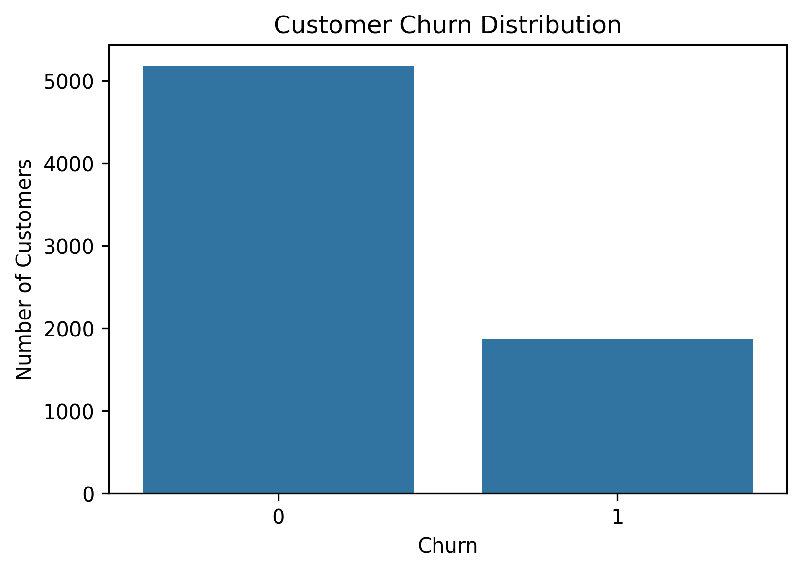
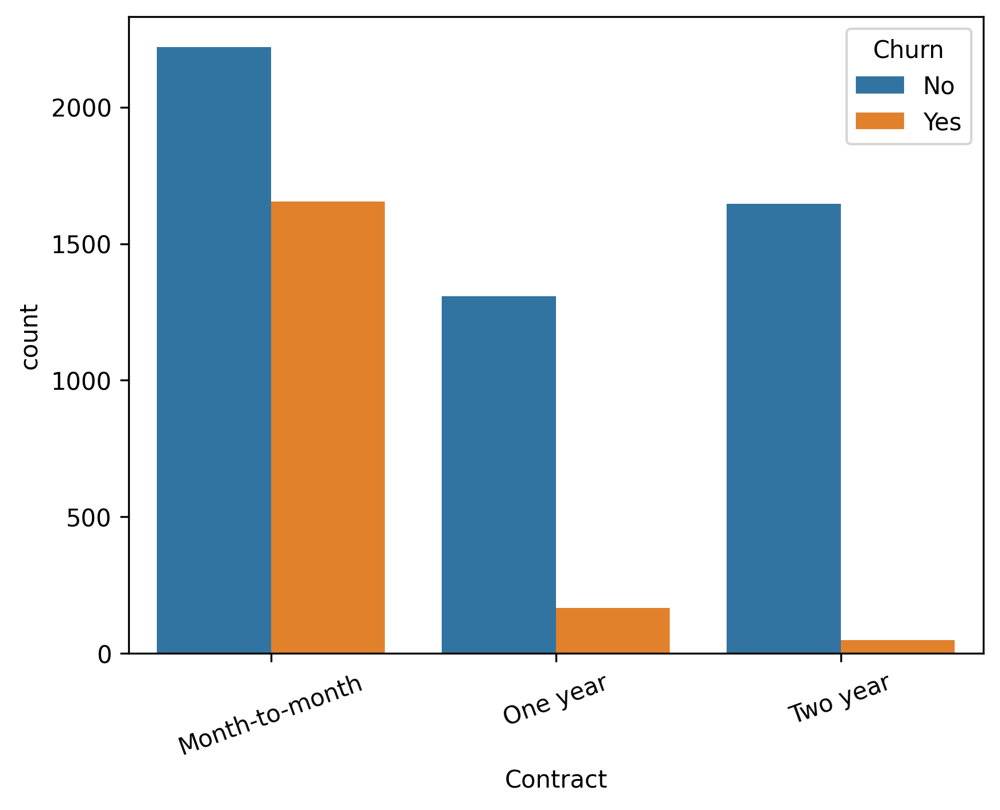
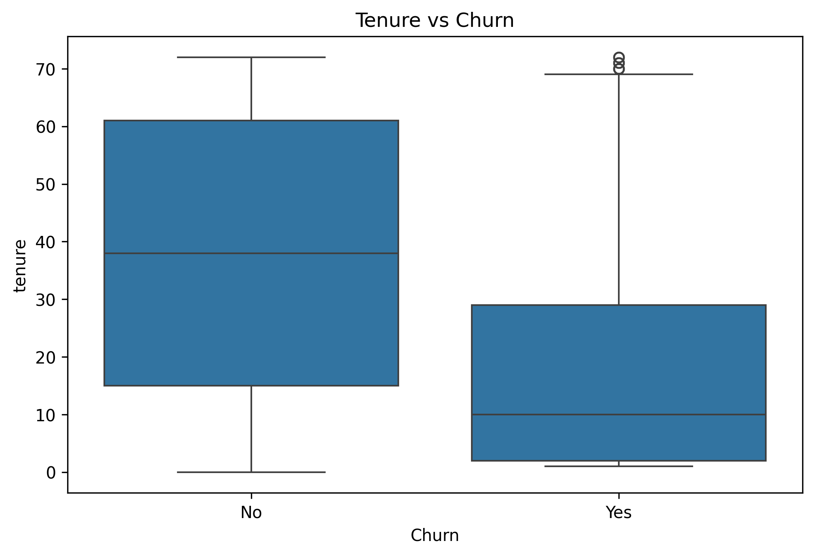
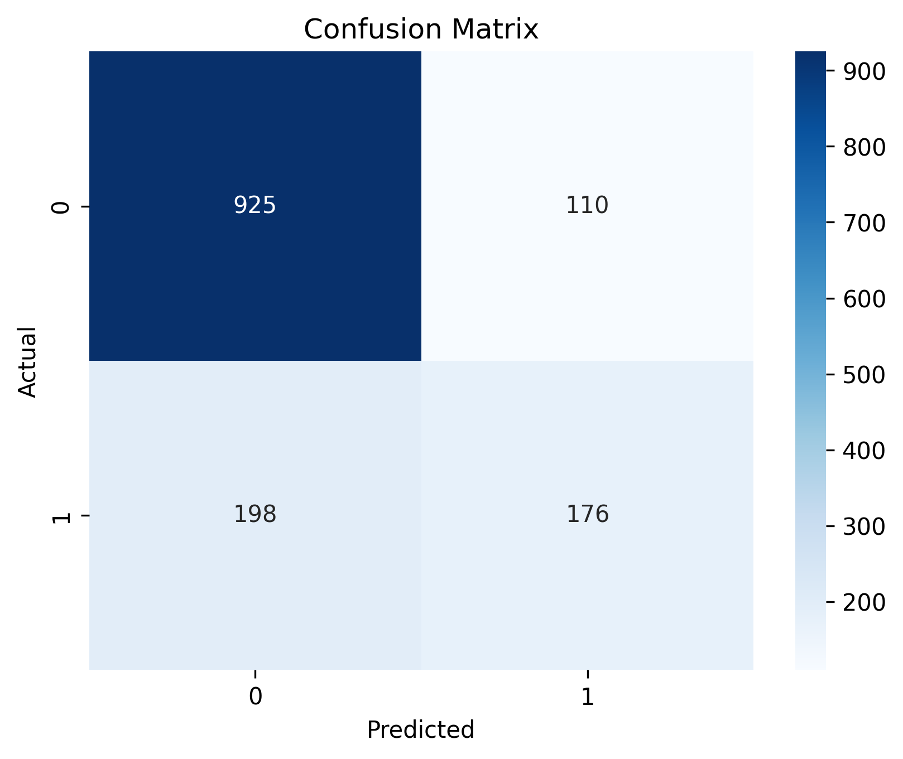
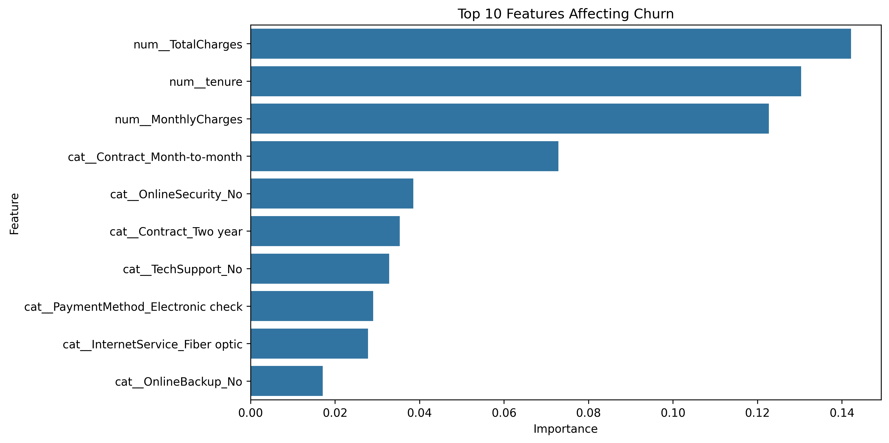
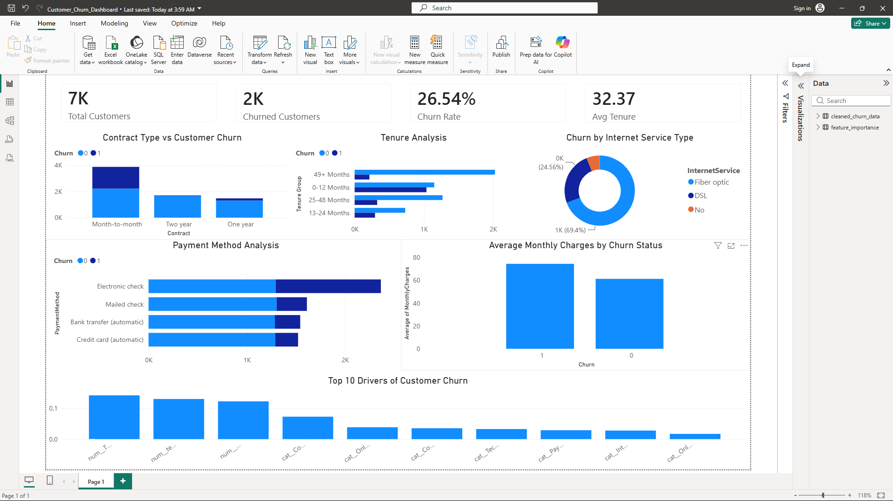

# Customer Churn Prediction and Business Analytics

## Project Overview

This project investigates customer churn in the telecommunications industry using machine learning and business intelligence techniques. The objective was to identify customers at risk of leaving the company, uncover the factors driving churn, and provide actionable recommendations to improve customer retention.

The project covers the complete data analytics workflow, including data cleaning, exploratory data analysis (EDA), feature engineering, predictive modelling, model evaluation, and dashboard development.

---

## Business Problem

Customer churn is a critical challenge for subscription-based businesses. Acquiring new customers is significantly more expensive than retaining existing ones. By identifying customers who are likely to leave, businesses can implement targeted retention strategies and reduce revenue loss.

This project aims to:

* Identify key drivers of customer churn.
* Predict whether a customer is likely to leave.
* Generate business insights to improve customer retention.
* Present findings through an interactive Power BI dashboard.

---

## Dataset

**Dataset:** IBM Telco Customer Churn Dataset

### Dataset Characteristics

* 7,043 customer records
* 20 predictor variables
* Binary target variable: Churn
* Customer demographics
* Service subscriptions
* Contract information
* Billing and payment data

### Key Variables

| Variable        | Description                                             |
| --------------- | ------------------------------------------------------- |
| tenure          | Number of months customer has remained with the company |
| MonthlyCharges  | Monthly amount charged to customer                      |
| TotalCharges    | Total amount charged during customer relationship       |
| Contract        | Contract type                                           |
| InternetService | Type of internet service                                |
| TechSupport     | Technical support subscription                          |
| OnlineSecurity  | Online security subscription                            |
| Churn           | Target variable                                         |

---

## Tools and Technologies

* Python
* Pandas
* NumPy
* Scikit-Learn
* Matplotlib
* Seaborn
* Power BI
* Jupyter Notebook
* Git & GitHub

---

## Exploratory Data Analysis

### Churn Distribution



Approximately 26% of customers in the dataset had churned, highlighting a class imbalance problem.

---

### Contract Type vs Churn



#### Insight

Customers on month-to-month contracts experienced significantly higher churn rates compared to customers on one-year and two-year contracts.

---

### Tenure vs Churn



#### Insight

Customers with shorter tenure were substantially more likely to churn, suggesting that retention efforts should focus on newer customers.

---

## Machine Learning Pipeline

### Data Preprocessing

* Missing value treatment
* Data type corrections
* Feature encoding
* Train-test split
* Pipeline-based preprocessing

### Models Evaluated

* Logistic Regression
* Decision Tree
* Random Forest

The Random Forest model produced the best overall performance.

---

## Model Performance

### Classification Report

| Metric    | Churn = 1 |
| --------- | --------- |
| Precision | 0.62      |
| Recall    | 0.47      |
| F1-Score  | 0.53      |

### Overall Accuracy

**78.1%**

---

### Confusion Matrix



#### Interpretation

* Correctly identified 925 retained customers.
* Correctly identified 176 churned customers.
* Accuracy exceeded 78%.
* Churn detection remains a challenging classification problem due to class imbalance.

---

## Feature Importance Analysis



### Top Drivers of Churn

1. Total Charges
2. Customer Tenure
3. Monthly Charges
4. Month-to-Month Contracts
5. Online Security
6. Two-Year Contracts
7. Technical Support
8. Electronic Check Payments

---

## Key Business Insights

### Customer Retention

Customers with shorter tenure are considerably more likely to leave.

### Contract Strategy

Month-to-month customers represent the highest-risk group.

### Pricing Impact

Higher monthly charges are associated with increased churn risk.

### Customer Support Services

Customers without technical support and online security services show higher churn probabilities.

---

## Recommendations

### Improve Onboarding

Implement targeted engagement strategies during the first year of customer tenure.

### Encourage Long-Term Contracts

Provide incentives for customers to move from month-to-month agreements to longer-term contracts.

### Customer Support Promotion

Bundle technical support and online security services to improve retention.

### High-Risk Customer Monitoring

Use predictive modelling to proactively identify customers likely to churn.

---

## Power BI Dashboard



The dashboard includes:

* Total Customers
* Churn Rate
* Average Monthly Charges
* Average Tenure
* Churn by Contract Type
* Churn by Internet Service
* Churn by Payment Method
* Feature Importance Analysis

---

## Project Structure

```text
Customer-Churn-Prediction-and-Business-Analytics/
│
├── data/
│   ├── customer_churn.csv
│   └── cleaned_churn_data.csv
│
├── notebooks/
│   └── churn_analysis.ipynb
│
├── dashboard/
│   └── Customer_Churn_Dashboard.pbix
│
├── reports/
│   └── Customer_Churn_Analysis_Report.pdf
│
├── images/
│   ├── contract_vs_churn.png
│   ├── tenure_vs_churn.png
│   ├── confusion_matrix.png
│   ├── feature_importance.png
│   └── dashboard.png
│
├── README.md
│
└── requirements.txt
```

---

## Results Summary

* Analysed 7,043 customer records.
* Developed a Random Forest model achieving 78.1% accuracy.
* Identified tenure, contract type, and monthly charges as the strongest predictors of churn.
* Created an interactive Power BI dashboard for stakeholder reporting.
* Generated actionable recommendations to improve customer retention.

---

## Author

**Dustin Greenwood**

Mathematical Sciences Graduate | Data Analyst | Machine Learning Enthusiast

GitHub: https://github.com/dustingreenwood2-a11y

